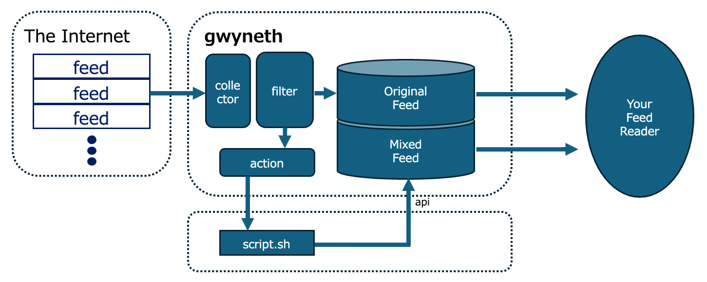

Gwyneth
===

**Gwyneth** is an RSS proxy that facilitates the retrieval and filtering of RSS feeds.  
It allows for the execution of scripts associated with filters.  

* **RSS Retrieval**: gwyneth can fetch RSS feeds from various sources.
* **Filtering**: It enables filtering of RSS feeds based on specified criteria.
* **Script Execution**: Associated scripts can be triggered to perform actions based on filter results.

  

Gwyneth's main function is that it is a feed proxy. There is a collector that collects the feeds and a DB that stores the originals.  
When storing the feeds, they can be passed through a pre-registered filter, and if they match the filter, an arbitrary script registered as an action can be fired.  
Scripts are directly called from those installed on the OS, so there are no restrictions on their operation.  
For example, it can be used to notify Slack by hitting a Webhook.  

Also, by executing Gwyneth's own API, new and unique feeds can be generated.  
Gwyneth has original feeds and mixed feeds as its domain, and by registering articles with specific conditions in the mixed feeds, it is possible to generate arbitrary feeds.  

## USAGE

API details are as per Swagger.  
Gwyneth's samples and Swagger can be activated as follows.  

```bash
cd docker
make
```

* gwyneth
	* http://localhost:8000/gwyneth/
* swagger
	* http://localhost:8000/swagger/


## Settings [samples](../samples/gwyneth.yaml)
```
database:
  host: <database's host>
  port: <port>
  database: <database's name>
  user: <user>
  password: <password>
http:
  host: <api's listen address>
  port: <api's listen port>
feed: <Setting up Feeds to be delivered>
  title: <feed's title>
  description: <feed's description>
  link: <link>
  author_name: <name>
  author_email: <email>
  default_type: <default feed type. (rss / json / atom)>
```

# Feature

Details are as per [gwyneth_swagger.yml](../docker/etc/gwyneth_swagger.yml).
Some excerpts are as follows.

## Subscribe Feed `POST /source/`
The collection is done by registering the URL of the RSS feed in the source.  
The type can be either rss or noop, and in the case of noop, a box can be prepared in which nothing is done.  

## Make Article `POST /article/`
You can register an article by POSTing it with the article API, whether it is an rss source or a noop source.  

```bash
body=$(cat << END
{
  "title": "new news 01",
  "body": "news description",
  "src": {
    "id": "13b46d3e-1612-4224-8865-a5b449bcbc61"
  },
  "link": "http://example.com/rss",
  "raw": "the raw data of article",
  "timestamp": 1710933677
}
END
)


curl -s -X POST -H 'Content-Type: application/json' -d ${body} http://localhost/gwyneth/api/article
```

## Bind Article `POST /feed/{feedId}`
You can link an article from SourceB to SourceA. 
Although the same operation can be performed by creating an article, the entity exists in SourceA because this operation simply links the article to SourceA.  

## Action & Filter `POST /action` and `POST /filter`
Action is fired if it matches the Filter. If necessary, specify the registration of Filter conditions and enable/disable at Source.  
The filter can specify a title and a body; it acts as an OR match, so if either one matches, the Action is executed.  

The script specified in action will be passed the following json as standard input.  

```json
{
    "id":"ad786d51-b928-4104-89ec-c0fb3cbf6dc6",
    "src":{
        "id":"174dc6ff-45f9-4b82-9131-d9617e4d4f5b",
        "title":"news title",
        "type":{
            "id":"3cc7575f-74d8-4ed2-8df5-f81ade8adc71",
            "name":"rss",
            "command":"rss",
            "user_create":false
        },
        "value":"http://example.com/feed",
    },
    "title":"news title",
    "body":"news body",
    "link":"http://example.com/article01",
    "timestamp":1716474780,
    "raw":"<raw>"
}
```

By using the json, you can manipulate the appropriate Feed by performing any desired process. For example, Slack notifications or re-registration to Gwyneth.  

### Sample: notification to Slack(Incoming Webhooks)

```bash
#!/bin/bash

exec {lock_fd}< "$0"
flock --nonblock ${lock_fd} || exit 0

input=$(cat -)

title=$(echo "$json_data" | jq -r '.title')
curl -s -X POST -H 'Content-Type: application/json' -d "{\"text\":\"recived new article: ${title}\"}" <YOUR-WEBHOOK-URL>
```

### Sample: linking to another Feed on Gwyneth

```bash
#!/bin/bash

ANOTHER_FEED_ID="1aa7575f-74d8-4ed2-8df5-f81ade8adc71"

exec {lock_fd}< "$0"
flock --nonblock ${lock_fd} || exit 0

input=$(cat -)

id=$(echo "$json_data" | jq -r '.id')
curl -s -X POST -H 'Content-Type: application/json' -d "{\"id\":\"${id}\"}" http://localhost/gwyneth/api/feed/${ANOTHER_FEED_ID}
```

### [Other Samples](./samples/scripts)
